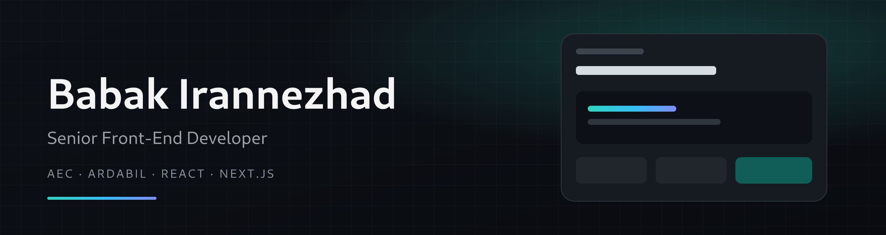

Senior front-end developer at AEC — RavanErtebat

  Production interfaces for telecom, payments, field operations, and 3D tools. 
  Ardabil, Iran

  

  

## Selected work

<table>
<tr>
<td width="33%" valign="top">

### Virtual Ring
AR ring try-on in the mobile browser. MediaPipe tracks the hand and Three.js places the ring.

`React` `Three.js` `TypeScript`

</td>
<td width="33%" valign="top">

### FieldOps
Field ticket app in Expo and React Native, led inside an Nx monorepo.

`React Native` `Expo` `Nx`

</td>
<td width="33%" valign="top">

### NanoDLP
Printer controller and a 3D editor for supports, hollowing, and repair. Three variants, one codebase.

`Next.js` `Electron` `Three.js`

</td>
</tr>
<tr>
<td width="33%" valign="top">

### IPG
Angular payment front office for Mobinnet, Irancell, X-Vision, and Mashhad Municipality.

`Angular`

</td>
<td width="33%" valign="top">

### SIB
Next.js customer flows with React Hook Form and TanStack Query.

`Next.js` `TanStack Query`

</td>
<td width="33%" valign="top">

### Taxi Wallet
React admin for Mashhad Municipality driver and app operations.

`React`

</td>
</tr>
</table>

Parsian Ecommerce CRM, Irancell Kudos, Nexuring, and Mobinnet B2B node monitoring.

## Earlier

**Kardari** and **Uptick** at Zharf Andish — freelance-service platforms on ASP.NET Core, with JWT auth, listings, and booking.

**BabaSanat** at Amaj Energy — agricultural commerce on ASP.NET Core and SQL Server.

B.Sc. Computer Software Engineering, University of Mohaghegh Ardabili.
